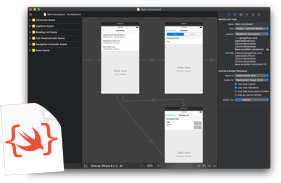
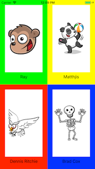

# storyboard2code

[](https://opensource.org/licenses/MIT)



**storyboard2code** is a command line tool for converting Storyboard XML to Swift code.

- [Features](#Features)
- [Conversion Examples](#conversion-examples)
- [Getting Started](#getting-started)
    - [Requirements](#requirements)
    - [Installation](#installation)
- [Usage](#usage)
    - [Converting the file](#converting-the-file)
    - [Options](#options)
- [Step by step guide to replacing storyboard](#step-by-step-guide-to-replacing-storyboard)
- [FAQ](#faq)    
- [Author](#author)
- [License](#license)
- [Acknowledgments](#acknowledgments)

## Features
- [x] Convert Storyboard XML to Swift source code.
- [x] Supports most controls and properties.
- [x] Supports Autolayout and Constraints.

## Conversion Examples

| | **Original** | **storyboard2code** |
|---|:---:|:---:|
| [Auto Layout Tutorial](https://www.raywenderlich.com/443-auto-layout-tutorial-in-ios-11-getting-started) |  |  |
| [Github - AutoLayoutManiacs](https://github.com/kishikawakatsumi/AutoLayoutManiacs) |  |  |

## Getting Started

### Requirements

* Xcode 10.0+

### Installation

1. Download the zip from [release page](https://github.com/watanabetoshinori/storyboard2code/releases).
2. Unzip and change the permission.

```sh
# Unzip file
unzip storyboard2code.zip

cd storyboard2code

# Change permission
chmod +x storyboard2code
```

## Usage

### Converting the file

To converting the file, launch the tool with Storyboard file path as argument.

```sh
./storyboard2code Main.storyboard
```

The `storyboard2code.swift` file will be generated in the same directory as the Storyboarf file when the conversion succeeds.

### Options

#### Output file name

You can specify the output file name with `--output` option.

```sh
./storyboard2code Main.storyboard --output Converted.swift
```

#### Code generate mode

You can specify the code generate mode (`class` or `extension`) with `--codegen` option.

```sh
./storyboard2code Main.storyboard --codegen extension
```

* class (default)

```swift
class ViewController: UIViewController {

	func viewDidLoad() {
		super.viewDidLoad()
		...
	}

}
```

* extension

```swift
extension ViewController {

	func loadLayouts() {
		...
	}

}
```

## Step by step guide to replacing storyboard

1. Convert your project Storyboard file to code.

```sh
./storyboard2code Main.storyboard --codegen extension
```

2. Add `storyboard2code.swift` file to your project.

3. Modify ViewController code to call `loadLyouts` function at `viewDidLoad`.

```swift
override func viewDidLoad() {
    super.viewDidLoad()

    loadLayouts()
}
```

4. Modify the code to call the ViewController directly.

```swift
// let viewController = self.storyboard?.instantiateViewController(withIdentifier: "ViewController") as? ViewController

let viewController = ViewController()
```

## FAQ

> When running the tool, a `dyld: Library not loaded: @rpath/libswiftCore.dylib` error occurred.

- This tool requires Swift environment. Please install xcode before running the tool.

## Author

Watanabe Toshinori – toshinori_watanabe@tiny.blue

## License

This project is licensed under the MIT License. See the [LICENSE](LICENSE) file for details.

## Acknowledgments

This application makes use of the following third party libraries:

*  [Commander](https://github.com/kylef/Commander)
*  [XMLParsing](https://github.com/ShawnMoore/XMLParsing)
*  [StencilSwiftKit](https://github.com/SwiftGen/StencilSwiftKit)
